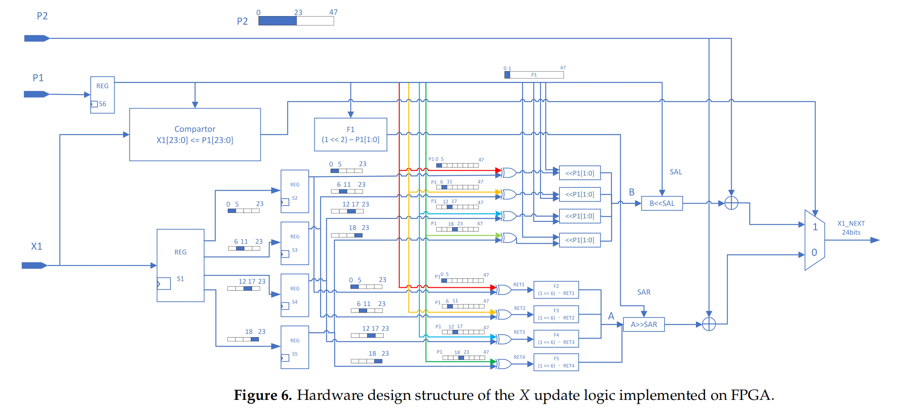

# MDDT-PRNG (FPGA) — 算法说明

本仓库开源的是一种基于多重深度动态变换（MDDT）的伪随机数发生器（PRNG）的FPGA实现思路与算法说明。该设计通过“轻算术 + 强置换”的策略，在较小位宽计算前提下实现每拍输出 96 bit 的高吞吐随机序列，核心包括两个状态子模块 `X1`/`X2` 与两个参数子模块 `P1`/`P2` 的耦合更新，以及输出异或掩码组合。

> 说明：本 README 仅解释算法与接口思路，不提供综合/仿真/运行脚本。

---

## 核心概念

- 状态寄存器：
  - `X1, X2`：各 24 bit，参与非线性置换与移位更新。
- 参数寄存器：
  - `P1, P2`：各 48 bit，采用类 skew tent map 的移位近似替代除法进行自激振荡式更新。
- 输出构成：
  - 每拍输出 96 bit：`Result = {out1, out2}`，其中 `out1/out2` 各 48 bit。

---

## 状态与参数定义

- 位宽约定：
  - `X1, X2 ∈ {0,1}^{24}`；`P1, P2 ∈ {0,1}^{48}`。
- 索引约定：
  - `P[k:l]` 表示 `P` 的高位到低位切片（包含端点）。
  - “低 24 位”指 `P[23:0]`，“高 24 位”指 `P[47:24]`。

---

## X 更新逻辑（X1 / X2）

X 更新采取“分块异或 + 条件移位 + 拼接 + 偏置相加”的流程。将 24 bit 的 `X` 按 6 bit 一组拆为 4 组，逐组做与 `P` 的 6 bit 切片异或，再按条件进行移位与拼接，最后叠加来自另一组参数的 24 bit 偏置。

### X1 更新

- 计算右移量：
  - `SAR1 ← 4 − P1[1:0]`。
- 分支 1（较小态）：
  - 条件：`X1 ≤ P1[23:0]`。
  - 对每个 6 bit 分组 `X1part(n)`：
    - `X1part(n) ← (X1part(n) ⊕ P1[6n−1 : 6n−6]) << P1[1:0]`。
  - 组装与更新：
    - 拼接：`X1 ← {X1part4, X1part3, X1part2, X1part1}`。
    - 更新：`X1_next ← P2[23:0] + (X1 << P1[1:0])`。
- 分支 2（较大态）：
  - 条件：`X1 > P1[23:0]`。
  - 对每个 6 bit 分组 `X1part(n)`：
    - `X1part(n) ← (64 − (X1part(n) ⊕ P1[6n−1 : 6n−6])) >> SAR1`。
  - 组装与更新：
    - 拼接：`X1 ← {X1part4, X1part3, X1part2, X1part1}`。
    - 更新：`X1_next ← P2[23:0] + (X1 >> SAR1)`。

> 注：分组后的单组宽度为 6 bit，移位量不应超过单组宽度。

### X2 更新

与 `X1` 类似，但使用 `P2` 驱动阈值与移位量，且偏置来源与分支相关。

- 计算右移量：`SAR2 ← 4 − P2[1:0]`。
- 分支 1（较小态）：
  - 条件：`X2 ≤ P2[23:0]`。
  - 每组更新：`X2part(n) ← (X2part(n) ⊕ P2[6n−1 : 6n−6]) << P2[1:0]`。
  - 拼接：`X2 ← {X2part4, X2part3, X2part2, X2part1}`。
  - 更新：`X2_next ← P1[47:24] + (X2 << P2[1:0])`。
- 分支 2（较大态）：
  - 条件：`X2 > P2[23:0]`。
  - 每组更新：`X2part(n) ← (64 − (X2part(n) ⊕ P2[6n−1 : 6n−6])) >> SAR2`。
  - 拼接：`X2 ← {X2part4, X2part3, X2part2, X2part1}`。
  - 更新：`X2_next ← P2[47:24] + (X2 >> SAR2)`。

---

## P 更新逻辑（P1 / P2）

`P` 的更新模拟 skew tent map，但以移位加法近似除法，降低资源与时延。

- 记 `P(n)` 表示 `P1` 或 `P2`：
  - 若 `P(n) < 0.45 · P_max`，则
    - `P(n) ← P(n) × 2.46875`（通过 1、1/2、1/4、1/16 的移位相加近似 `÷ 0.45`）。
  - 若 `P(n) ≥ 0.45 · P_max`，则
    - `P(n) ← (P_max − P(n)) × 1.8125`（通过移位组合近似 `÷ 0.55`）。

上述系数选取兼顾硬件代价与逼近精度，避免直接做除法导致的资源开销。

---

## 输出组合与掩码

每拍产出 96 bit，由两个 48 bit 的块经异或掩码得到：

- out1：
  - 计算：`out1 = {X1, X2_next} ⊕ P1`。
- out2：
  - 计算：`out2 = {X2, X1_next} ⊕ P2`。
- 总输出：
  - `Result = {out1, out2}`，位宽 96 bit。

---

## 公式汇总

- X1 更新（示意）：
  $$
  \text{SAR1} = 4 - P1[1:0]
  $$
  $$
  X1_{\text{next}} =
  \begin{cases}
  P2[23:0] + (X1 \ll P1[1:0]), & X1 \le P1[23:0] \\
  P2[23:0] + (X1 \gg \text{SAR1}), & X1 > P1[23:0]
  \end{cases}
  $$
- X2 更新（示意）：
  $$
  \text{SAR2} = 4 - P2[1:0]
  $$
  $$
  X2_{\text{next}} =
  \begin{cases}
  P1[47:24] + (X2 \ll P2[1:0]), & X2 \le P2[23:0] \\
  P2[47:24] + (X2 \gg \text{SAR2}), & X2 > P2[23:0]
  \end{cases}
  $$
- 输出：
  $$
  \text{out1} = \{X1, X2_{\text{next}}\} \oplus P1,\quad
  \text{out2} = \{X2, X1_{\text{next}}\} \oplus P2
  $$
  $$
  \text{Result} = \{\text{out1}, \text{out2}\}
  $$

以上式子中的“分组异或、条件移位与拼接”过程隐含在 `X1, X2` 的更新内部。

---

## 性能与实现要点（参考）

- 吞吐：每拍 96 bit；在 150 MHz 时约 14.4 Gbps（参考 Kintex‑7 实测时序报告，WNS/TNS 均为正）。
- 资源：示例实现占用约 0.67% 的 FPGA 资源（参考对比表）。
- 设计要点：
  - 全流程仅用移位/加法/XOR，避免乘除法与大规模表驱动。
  - 6 bit 分组的最大移位量受限于单组位宽，确保无越界与溢出。
  - `P` 的自激与 `X` 的交叉耦合提升序列的不可预测性。

---

